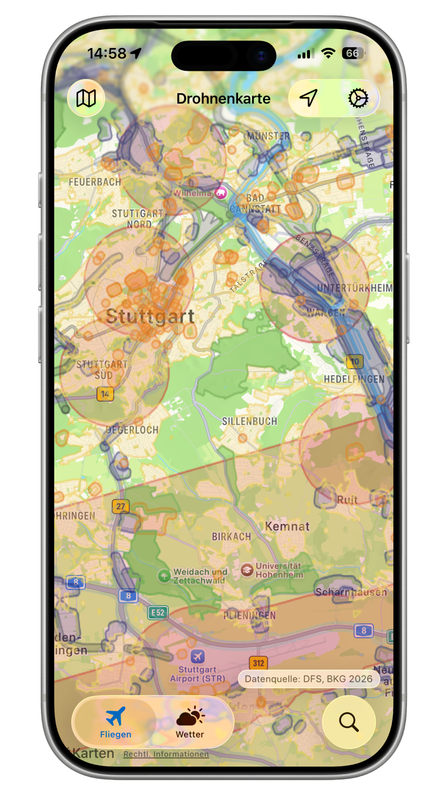

# safeFLY

### Fly Responsibly. Explore Airspace with Confidence.

**safeFLY** is the essential iOS map companion for drone pilots in Germany —
real-time air traffic control zones, nature reserves, wind profiles, and
instant flight validation, built on **official DFS mapping data**.

🌐 [gruettecloud.com/safeFLY](https://gruettecloud.com/safeFLY) &nbsp;·&nbsp; 🍏 [App Store](https://apps.apple.com/de/app/safefly/id6755426394)

---

> ⚠️ **Disclaimer:** safeFLY is an unofficial tool and is **not** a source of
> truth for flight clearance. Geozone and weather data are retrieved from
> third-party services (see [Data sources](#data-sources)) and may be
> incomplete, delayed, or inaccurate. Always confirm with official sources
> and comply with all applicable regulations before flying.

## Features

### 🗺️ Drone map
Interactive MapKit view with the official **DIPUL / DFS** geozone overlay
rendered live as a WMS layer. Tap anywhere to check that location. Toggle the
layers you care about:

- Airports & aerodromes
- Control zones & restricted areas
- Temporary flight restrictions
- Nature reserves & recreational areas
- Residential, industrial & government areas
- Motorways, highways, railways & waterways
- Model flying fields

### 📍 Zone details & flight validation
Tap a point to see the geozones affecting it — zone **name**, **type**,
**restriction**, **upper/lower altitude limits**, and the **legal reference**
behind each one — so you get an instant read on whether you can fly there.

### 🌤️ Wind & weather (DFS ICON-D2 model)
Aeronautical weather tailored to drone operations, with a 24-hour hourly forecast:

- **Wind profile at 10 / 50 / 100 / 150 m AGL** (speed + direction)
- **Gusts** at 10 m AGL
- **QNH** (pressure), **temperature**, **humidity**
- **Cloud cover** and **rain / snow** precipitation

General forecast data falls back to Open-Meteo where the DFS coverage area
doesn't apply.

### ⚙️ Pilot profile
Store your **drone class** (C0–C4) and **operator ID** for quick reference,
plus onboarding to get set up fast.

### 🌍 Localization
Fully available in **English** and **German**.

## Data sources

safeFLY only queries public endpoints; it does not redistribute their data.

| Source | Used for |
| --- | --- |
| **DIPUL** (Digitale Plattform Unbemannte Luftfahrt) | geozone WMS overlay |
| **DFS Deutsche Flugsicherung** | aeronautical weather (UTM weather service, ICON-D2) |
| **Open-Meteo** ([open-meteo.com](https://open-meteo.com)) | general weather forecast |

These services are not affiliated with this project and retain all rights to
their respective data.

## Requirements

- iOS 18.0 or later
- Xcode 16 or later

## Building

1. Clone the repo and open `safeFLY.xcodeproj` in Xcode.
2. Set your own signing team: select the **safeFLY** target →
   **Signing & Capabilities** → choose your **Team**. (The committed
   `DEVELOPMENT_TEAM` belongs to the original author and won't work for you.)
   You may also want to change the bundle identifier
   (`com.gruettecloud.droneMaps`).
3. Build and run on a simulator or device.

No API keys are required — all backing services are public and keyless.

## Contributing

Contributions are welcome! Bug reports, feature ideas, and pull requests all help.

By contributing, you agree that your contributions are licensed under the
Apache License 2.0.

## Support the project

If safeFLY is useful to you, you can support its development:

## License

Licensed under the [Apache License 2.0](LICENSE).

Icons are from [Google Material Symbols](https://fonts.google.com/icons),
also licensed under Apache 2.0. See [NOTICE](NOTICE) for attributions.
